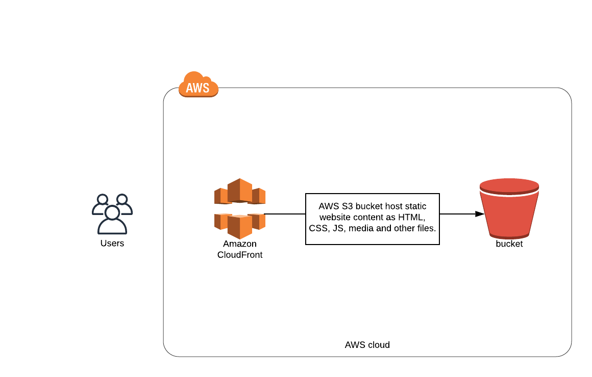

# Project 1 - Deploy Static Website on AWS 

### Diagram for the Travel Blog Static Web Site deployment on AWS



```sh
In this first project, I deployed a static website on AWS using S3, CloudFront, and IAM.
```

## The files included are:

```sh
* /Images : Screenshots of the steps followed in this project.
* /Travel Blog - Web Site : Website files.
* Policy.json : Bucket's policy.
```
